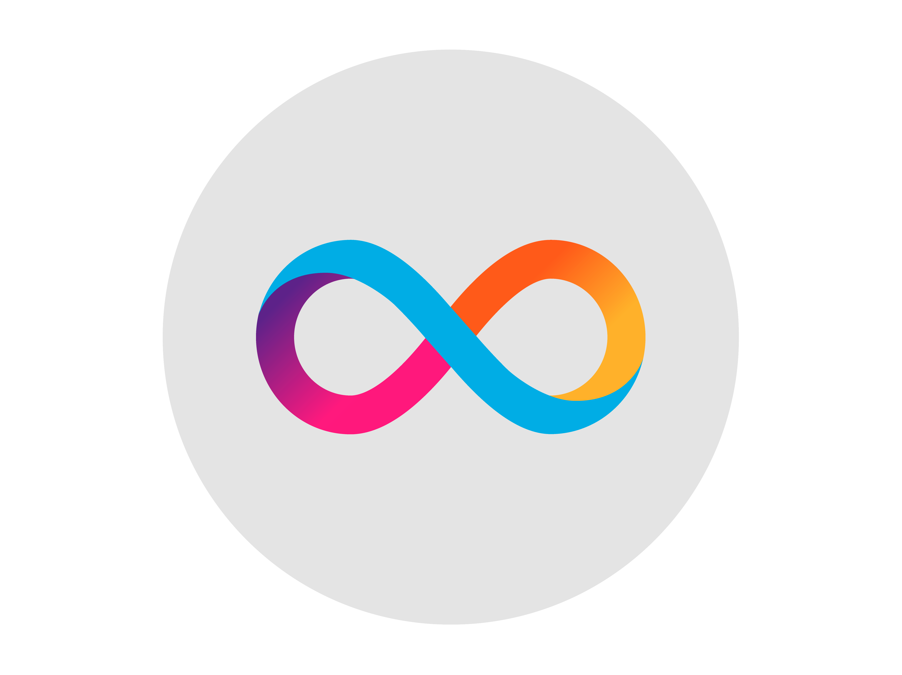

Software Engineer. Based in the Netherlands 🇳🇱

I'm currently working at [Orbisk.com](https://www.orbisk.com/), fighting the good fight against the food waste.

Note: I have been mostly working with GitLab in the last few years, so here, on GitHub, you will find my personal
projects, learning projects, and some open source contributions.

If you're curious about my usual working style, just scroll down to the pinned repositories, where you'll find a collection of showcases.

## `Latest blog posts'
- [Slog: The Future Face of Go Logging?](https://itnext.io/slog-the-future-face-of-go-logging-d82ee9073a04)
- [Go Excellence: Three Common Interface Mistakes Even Seasoned Devs Overlook](https://itnext.io/go-excellence-three-common-interface-mistakes-even-seasoned-developers-overlook-1cbf077767d8)
- [Go Excellence: A Deep Dive into Error Handling](https://itnext.io/go-excellence-a-deep-dive-into-error-handling-4b74697f12a1)
- [Go Excellence: Dodge Three Mistakes and Tame the Dreadful Named Results](https://itnext.io/go-excellence-dodge-mistakes-and-unlock-the-power-of-named-returns-e811f9665d2)
- [Go Comments: The Missing Link in Your Code’s Story](https://itnext.io/go-comments-the-missing-link-in-your-codes-story-a4a0f16cdaed)
- [Bug Busters 101: Unleashing the Power of Precision Bug Reporting](https://itnext.io/bug-busters-101-unleashing-the-power-of-precision-bug-reporting-1208fa35265e)
- [Ten Commandments of the Eternal Junior Developer](https://do-tech.medium.com/ten-commandments-of-the-eternal-junior-developer-8a473a1f4978)

## `My GitHub Stats`

## `My Tech Stack`

Note: Some icons are missing, I will add them as soon as they are available.

[//]: # (Need to add the following icons as soon as the issues are closed for them: ClickHouse, terraform, PyCharm, Goland, gRPC, protobuf, helm, kibana, macOS)

## `Currently focused on ...`

#### `Expanding horizons of my knowledge of programming with Internet Computer, blockchain, and smart contracts`

## `Learning next`

TBA

## `Drop me a line`

